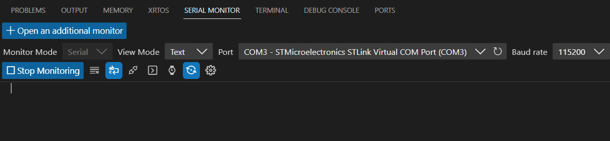

# STM32 Nucleo Interrupt Driven LED-UART Demo

This project showcases how to use an external interrupt with an STM32 microcontroller to trigger a UART transmission. When the Nucleo board's button is pressed, an interrupt is generated, turning on the user LED and sending a "Button Pressed" message through UART.

---

## Project Structure

- **`main.c`**: Contains the main program logic, including the initialization of the external interrupt (EXTI) and UART, and an infinite loop where the microcontroller waits for an interrupt.
- **`uart.c`**: Manages UART initialization and functions for transmitting data.
- **`exti.c`**: Handles the external interrupt initialization and its callback function.

## Requirements

- STM32F4 Nucleo microcontroller
- Serial terminal (like PuTTY or Realterm) for UART communication
- USB connecting cable

## How it Works

- The `pc13_exti_init()` function configures the PC13 pin (user button) to trigger an interrupt on a falling edge (button press).
- The `uart2_tx_init()` function sets up UART2 for communication.
- When the button is pressed, the `EXTI15_10_IRQHandler` function is called, which in turn calls `exti_callback()`.
- In `exti_callback()`, the LED state is toggled, and a message is printed to UART.

## Demo

### Serial Monitor Output

### Project Video Demonstration

[Project Video Demonstration](demo/video.mp4)

